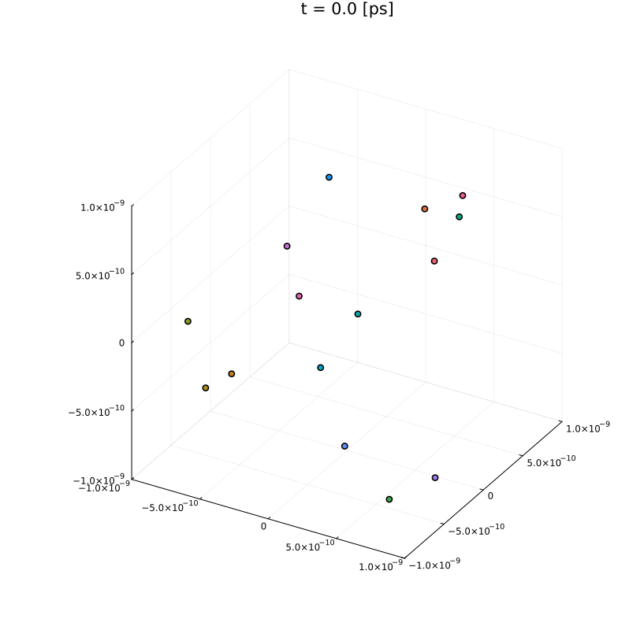

# Condensim

Molecular dynamics simulation in **Julia**: kinetic theory of gases, elastic collisions, gravity, Shannon entropy, thermal walls, and the Lennard-Jones potential up to neon condensation.

<p align="center">
  
</p>

## Install

```bash
julia --project=. -e 'using Pkg; Pkg.instantiate()'
```

## Usage

```bash
julia --project=. bin/main.jl
```

All simulations run in sequence and write their animations and plots to `export/` (one subfolder per question).

## Tests

```bash
julia --project=. test/runtests.jl
```
